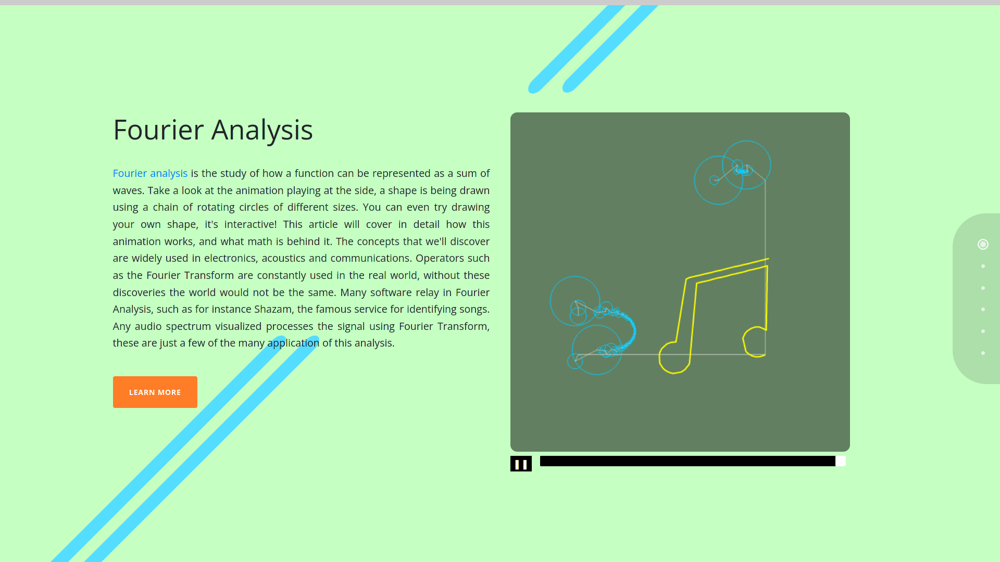

# fourier-series

Fourier analysis is a method of defining periodic waveforms in terms of trigonometric functions. This branch
of mathematics is widely used in signal processing, especially electronics, acoustics and communications.
Many notorious algorithms have been developed thanks to Joseph Fourier. Operators such as the Fourier
Transform are constantly used in the real world, without these discoveries the world would not be the same.
Many software rely in Fourier Analysis, such as for instance Shazam, the famous service for identifying songs.
Any audio spectrum visualized processes the signal using Fourier Transform, these are just a few of the many
application of this analysis.

 

The live version of the final product is available at https://paolobettelini.github.io/fourier-series.

 

